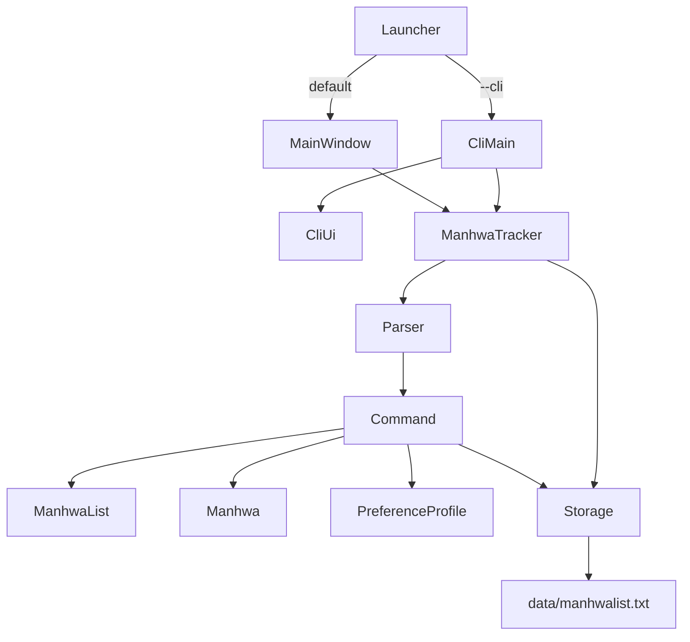

# ManhwaDex Lite Developer Guide

## 1. Purpose and release baseline

ManhwaDex Lite is a single-user Java 25 desktop application with two frontends:

- a Swing conversation window launched by default; and
- a scriptable CLI selected with the `--cli` argument.

Both frontends use the same controller, command objects, domain model, and pipe-delimited local
storage. There are no production dependencies outside the JDK. Gradle, JUnit 5, and the Shadow
plugin provide build, test, and packaging support.

## 2. Development environment

### Prerequisites

- JDK 25
- Git
- Internet access for the first Gradle Wrapper build

The wrapper pins Gradle 9.7.1. The build uses Shadow 9.6.1 and the JUnit BOM 5.13.4.

### Common commands

Windows:

```text
.\gradlew.bat clean build
.\gradlew.bat test
.\gradlew.bat shadowJar
.\gradlew.bat run
.\gradlew.bat run --args="--cli"
```

macOS/Linux:

```text
./gradlew clean build
./gradlew test
./gradlew shadowJar
./gradlew run
./gradlew run --args="--cli"
```

`build` depends on `shadowJar`, so a successful full build creates the executable fat JAR at
`build/libs/manhwadexlite.jar`. Assertions are enabled for Gradle test tasks, Java compilation
uses UTF-8, and `-Xlint:all` is enabled.

## 3. Architecture

### 3.1 Component overview



The package root is `manhwa`; concrete command classes are in `manhwa.commands`.

### 3.2 Entry points and UI layer

`Launcher` is the JAR manifest main class. It scans the arguments for the exact `--cli` flag.
If present, it delegates to `CliMain.main`; otherwise it schedules GUI construction with
`SwingUtilities.invokeLater`.

Both startup paths perform the same initialization:

1. construct `Storage("data")`;
2. create the directory and file if absent;
3. load a `ManhwaList` and optional `PreferenceProfile` through `LoadResult`; and
4. construct `ManhwaTracker` with those objects.

`CliMain` uses the `Ui` abstraction and `CliUi`, which wrap a `Scanner`, `System.in`, and
`System.out`. It reads one line, sends it to `ManhwaTracker.getResponse`, and prints the reply
until the controller reports exit or input reaches EOF.

`MainWindow` is a `JFrame` with a read-only scrollable `JTextArea` and a `JTextField`. An action
event from Enter appends the user's line, calls the same `getResponse` method, appends the
reply, and clears the field. A successful `bye` disables the field. The GUI deliberately talks
to `ManhwaTracker` directly; there is no `SwingUi` adapter in this release.

### 3.3 Controller and conversation state

`ManhwaTracker` is the application coordinator and the only class that reads or changes
`ConversationState`. It owns the active list, current preference profile, storage service,
pending flow objects, next aspect index, and last-command exit flag.

In `IDLE`, `getResponse` rejects blank input or asks `Parser` to create a command and executes
it. In another state, the same input is interpreted as an answer to the pending flow. User-
facing `ManhwaTrackerException`s are caught at this boundary and converted into reply strings.

```mermaid
stateDiagram-v2
    [*] --> IDLE
    IDLE --> AWAITING_IMPORTANCE: startup without PREF / onboard / rerank
    AWAITING_IMPORTANCE --> AWAITING_IMPORTANCE: valid answer, aspects remain
    AWAITING_IMPORTANCE --> IDLE: fifth valid answer; save profile

    IDLE --> AWAITING_STATUS: add title
    AWAITING_STATUS --> IDLE: wishlist; save entry
    AWAITING_STATUS --> AWAITING_RATINGS: ongoing or completed

    IDLE --> AWAITING_RATINGS: status change with missing ratings
    AWAITING_RATINGS --> AWAITING_RATINGS: valid answer, aspects remain
    AWAITING_RATINGS --> IDLE: final rating; save entry/status

    AWAITING_IMPORTANCE --> IDLE: cancel
    AWAITING_STATUS --> IDLE: cancel
    AWAITING_RATINGS --> IDLE: cancel
```



Invalid numeric answers leave the state and aspect index unchanged. `cancel`, matched without
regard to case while a flow is active, resets every pending field without saving. A status
change uses a temporary rating copy so cancellation cannot partially modify the stored entry.

### 3.4 Parser and Command pattern

`Parser` is a stateless factory. It splits the first word, validates argument shape and simple
types, and returns one `Command` subclass. It does not access the list or storage. Command words
are exact lowercase strings; enum parsers for status, aspect, and sort key are case-insensitive.

`Command` stores whether a command exits and declares one `execute` method. Concrete commands
receive `ManhwaList`, the current profile, `Storage`, and the controller. Most commands are
single-step operations. `AddCommand`, `OnboardCommand`/`RerankCommand`, and some
`StatusCommand` executions start controller-managed multi-turn flows instead of mutating data
immediately.

Commands by responsibility:

| Category | Commands |
|---|---|
| Flow and lifecycle | `onboard`, `rerank`, `add`, `cancel`, `bye` |
| Read-only views | `list`, `listall`, `find`, `filter`, `sort`, `stats`, `help` |
| Entry mutations | `delete`, `status`, `rate`, `chapter`, `tag`, `untag`, `note` |

`DisplayUtil` is package-private and centralizes compact list-row, detailed-entry, and score
formatting. The `listall` view includes every entry field and the rating, weight, and weighted
contribution for each aspect. Sorted and filtered views are copies. They are renumbered for
display but do not alter the underlying list; index-based mutations always address the stored
list order.

### 3.5 Domain model

`Aspect` defines the fixed order `PLOT`, `ART`, `UNIQUENESS`, `CHARACTERS`, `PACING` and owns
case-insensitive parsing of their display names.

`Status` defines `WISHLIST`, `ONGOING`, and `COMPLETED`, also with case-insensitive parsing.

`Manhwa` owns:

- an immutable title and in-memory `dateAdded`;
- mutable status;
- an `EnumMap<Aspect, Integer>` of optional ratings;
- current and total chapter integers;
- insertion-ordered tags; and
- an optional note.

The model validates rating, chapter, tag, and note invariants. It also owns MANHWA record
serialization and parsing.

`PreferenceProfile` stores one importance from 1 to 5 for every aspect in an `EnumMap`. A new
profile starts with weight 1 for all aspects. It owns PREF record serialization and parsing.

`ManhwaList` wraps the mutable entry collection. Its public indices are 1-based. It enforces
case-insensitive title uniqueness and returns fresh lists for searches, filters, and sorts.

`LoadResult` transports the list and optional profile from storage without coupling `Storage`
to the controller.

### 3.6 Score calculation and sorting

`Manhwa.getOverallScore` calculates:

```text
sum(profile weight x rating) / sum(profile weight)
```

Only rated aspects participate. `BigDecimal` division with `RoundingMode.HALF_UP` rounds to one
decimal place. An entry with no ratings returns `-1.0`; display code converts that sentinel to
`-`.

`ManhwaList.sortedView` copies the stored list and applies a comparator:

- score, date, chapters, and aspect ratings: descending;
- title: ascending, case-insensitive; and
- missing aspect ratings: last.

Score sorting naturally puts the `-1.0` unrated sentinel last. Sorts are stable when comparator
values tie because Java's list sort is stable.

## 4. Persistence design

`Storage` uses Java NIO and UTF-8. The path supplied by both launchers is the relative directory
`data`, and the file name is `manhwalist.txt`. Startup creates both if necessary.

Every successful mutation serializes the full dataset to a sibling temporary file, flushes it,
keeps the previous non-empty data as `manhwalist.txt.bak`, and replaces the live file with an
atomic move where the file system supports it. A separate `manhwalist.txt.lock` coordinates
application processes. Each `Storage` instance remembers the bytes it loaded and rejects a save
when another process has changed the file, preventing a stale instance from overwriting newer
data. Read-only commands do not save. Mutations that finish an interactive flow are saved by
`ManhwaTracker`; direct mutations are saved by their command.

### 4.1 Actual file format

The optional profile record appears first:

```text
PREF | plot=5 | art=4 | uniqueness=3 | characters=4 | pacing=2
```

Each entry currently has exactly seven fields:

```text
MANHWA | <title> | <STATUS> | <comma tags> | <semicolon ratings> | <current>/<total> | <note>
```

Example:

```text
MANHWA | Solo Leveling | ONGOING | action,fantasy | plot=9;art=10;uniqueness=8;characters=7;pacing=8 | 143/179 | The art carries the story
```

Empty tags, ratings, and notes are represented by empty fields. No chapter progress is `0/0`.
Status is serialized with the uppercase enum name. Ratings are serialized in the fixed aspect
order. Because commas delimit tags, user-entered tags cannot contain commas, pipes, or
whitespace.

`dateAdded` is not included in the actual storage record. Deserialization constructs a new
`Manhwa`, so loaded entries receive `LocalDate.now()`.

### 4.2 Loading and corruption handling

Storage reads line by line. It accepts one valid PREF record and valid MANHWA records. Unknown,
duplicate-profile, malformed, or domain-invalid lines are skipped independently and reported to
`System.err` as:

```text
Warning: skipping corrupt line: <original line>
```

The remaining valid data is returned. A missing PREF record yields a null profile and triggers
startup onboarding. A file-level I/O failure prevents startup and is displayed in the CLI or an
error dialog in the GUI. Storage wraps save failures and stale-writer conflicts in
`UncheckedIOException`; `ManhwaTracker` catches that exception, reloads the latest durable
snapshot, resets any interactive flow, and returns a user-facing error. If reload itself fails,
the response tells the user to restart before making more changes.

## 5. Error-handling strategy

Expected input and domain errors use `ManhwaTrackerException`. The parser creates format errors;
enum and model types create value errors; and `ManhwaList` creates index and duplicate errors.
The controller catches this checked type and returns its exact message. It also handles storage
save failures centrally by restoring the durable snapshot, keeping both UIs free of
command-specific exception handling.

Non-null collaboration invariants are expressed with Java `assert`. Gradle enables assertions
during tests. Assertions are not a substitute for user-input validation and are normally
disabled in packaged production execution unless Java is started with `-ea`.

## 6. Testing strategy

### 6.1 Automated tests

The JUnit 5 suite is under `src/test/java/manhwa`. At the time this guide was written, the clean
build ran 122 tests successfully. Coverage is organized by responsibility:

- parser and enum validation: `ParserTest`, `AspectTest`, `StatusTest`;
- domain calculations and collection behavior: `ManhwaTest`, `PreferenceProfileTest`,
  `ManhwaListTest`;
- storage creation, round trips, missing data, and corrupt lines: `StorageTest`;
- controller and interactive state transitions: `ManhwaTrackerTest`, `ConversationFlowTest`,
  `OnboardFlowTest`, `StatusFlowTest`;
- commands and exact responses: command-specific test classes; and
- CLI adapter behavior: `CliUiTest`.

Run everything:

```text
.\gradlew.bat clean test
```

or:

```text
./gradlew clean test
```

Run one class while developing:

```text
.\gradlew.bat test --tests "manhwa.StorageTest"
```

The Swing layer intentionally has no unit tests in this release. It contains no domain logic
and is verified manually, while controller behavior is exercised through the existing suite.

### 6.2 Manual GUI smoke test

1. Run `./gradlew shadowJar` or `gradlew.bat shadowJar`.
2. Run `java -jar build/libs/manhwadexlite.jar` without `--cli`.
3. Confirm the welcome text and any required onboarding prompt are present.
4. Confirm the log cannot be edited.
5. Enter `help` and confirm both `> help` and the reply are appended.
6. Exercise `add`, including a multi-turn ongoing entry with five ratings.
7. Run `list` and confirm the saved entry is displayed.
8. Enter `bye`; confirm the farewell is appended and the field is disabled.
9. Restart from the same working directory and confirm persistence.

### 6.3 CLI and scripted test

The supported CLI launch is:

```text
java -jar build/libs/manhwadexlite.jar --cli
```

The `text-ui-test` input and expected transcript cover startup onboarding, adding an ongoing
entry, list, score sort, statistics, and exit. However, the current `runtest.bat` and
`runtest.sh` invoke the fat JAR without `--cli`. Since `Launcher` now defaults to Swing, the
scripts must add `--cli` to the `java -jar` command before they can serve as unattended tests.
That correction is not part of the documentation-only change that introduced this guide.

## 7. Software engineering process

Development followed small vertical feature slices recorded in Git history:

1. enums, exception, model, list, CLI adapter, and storage;
2. command abstraction and parser/controller wiring;
3. list, delete, and find;
4. conversation state and add/cancel;
5. onboarding, scoring, status, rating, sorting, tags, and chapters;
6. notes, help, statistics, and the text-UI test; and
7. the Swing launcher and window.

Each slice paired production changes with focused JUnit tests unless the slice was explicitly
manual-only, such as Swing. Exact user-facing strings were tested where commands form part of
the public interface. Full-rewrite persistence was deliberately selected over incremental
updates to keep a small, single-user application understandable and deterministic.

The implementation applies these design practices:

- Command pattern for one class per user action.
- Single responsibility between parsing, orchestration, domain validation, formatting, and
  persistence.
- A state machine for multi-turn input rather than UI-specific callbacks in business logic.
- Dependency injection of list/profile/storage into the controller and streams into `CliUi` to
  keep tests isolated.
- Immutable or copied views where callers should not mutate collection internals.
- Constants for commands, formats, validation bounds, and user-facing messages.
- Javadoc on public APIs and assertions on internal non-null invariants.
- Save-before-return for successful data mutations.

## 8. Adding or changing a feature

For a new single-step command:

1. Add a command class under `manhwa.commands` with a `COMMAND_WORD` constant.
2. Keep syntax validation in `Parser` and data behavior in the command/model.
3. Add the parser case and exact format error.
4. Save through `Storage` before returning if data changed.
5. Add the format to `HelpCommand`.
6. Add parser, success, error, and persistence tests.
7. Update both guides.

For a multi-turn command, add only the minimum required state to `ManhwaTracker`; UI classes
must continue to submit one line and display one response without knowing the conversation
state.

Storage format changes require backward-compatibility consideration and updates to model
serialization, model parsing, `StorageTest`, sample records, and both guides.

## 9. Known limitations and specification deviations

- `MainWindow` calls the controller directly; the `SwingUi`/`SwingMain` sketch in
  `Guidelines.md` is not implemented. This was a deliberate later feature decision.
- MANHWA records have seven fields and do not persist `dateAdded`, although the broader guideline
  describes a date field. Consequently, `sort date` cannot preserve original creation dates
  across restarts.
- A hyphen (`-`) and `-/-` are used for unavailable scores and chapters instead of an em dash to
  avoid the CLI display problem recorded in project history.
- Sorted, searched, and filtered views use local display numbering. Index-based commands still
  use permanent stored-list indices.
- The text-UI scripts need `--cli` after the launcher changed to GUI-by-default.
- The GUI has manual smoke coverage only and performs storage operations on the Swing event
  dispatch thread. This is acceptable for the intended small local file but would not scale to
  slow or remote storage.

## 10. Acknowledgements

- The product scope, command set, weighted rating idea, architecture, and staged implementation
  were developed from the repository's [project guideline](Guidelines.md). The recorded
  [ideation log](../logs/log1-ideation.md) states that an earlier personal project named Kyrie
  inspired the command-driven CRUD structure, parser-to-command dispatch, tolerant storage,
  CLI-first workflow, and GUI wrapper. The Duke-style build/run/diff text-UI convention also
  informed `text-ui-test`. These were conceptual references; no Kyrie source file is included
  in this repository.
- OpenAI ChatGPT assisted with ideation and specification drafting, and OpenAI Codex assisted
  with feature-by-feature implementation and documentation. The development approach and sample
  prompts are recorded in [log1-ideation.md](../logs/log1-ideation.md) and
  [log2-milestone1.md](../logs/log2-milestone1.md). Human review selected the scope and verified
  the generated work. See the [official Codex information](https://help.openai.com/en/collections/14937394-codex).
- The repository uses the [Gradle Wrapper](https://docs.gradle.org/current/userguide/wrapper_plugin.html).
  The generated `gradlew` and `gradlew.bat` scripts retain Gradle's Apache License 2.0 notices.
- The [GradleUp Shadow plugin](https://gradleup.com/shadow/) creates the executable fat JAR.
- [JUnit 5](https://junit.org/junit5/docs/current/user-guide/) supplies the test framework and
  assertions used by the automated suite.
- The GUI uses Java's standard Swing APIs, following the platform concepts documented in the
  [Oracle Swing tutorial](https://docs.oracle.com/javase/tutorial/uiswing/). No third-party GUI
  library or FXML is used.
